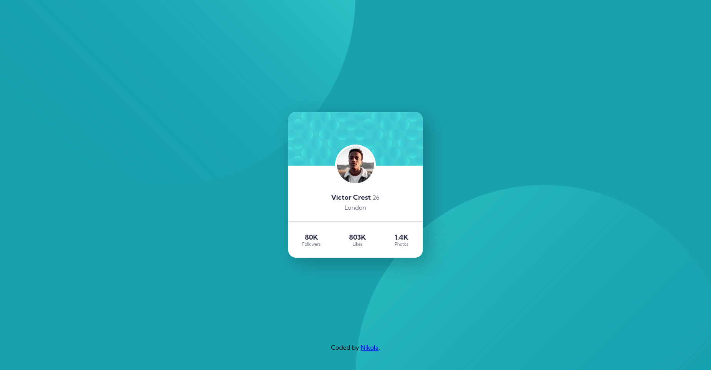

# Frontend Mentor - Profile card component solution

This is a solution to the [Profile card component challenge on Frontend Mentor](https://www.frontendmentor.io/challenges/profile-card-component-cfArpWshJ). Frontend Mentor challenges help you improve your coding skills by building realistic projects.

## Table of contents

- [Overview](#overview)
  - [The challenge](#the-challenge)
  - [Screenshot](#screenshot)
  - [Links](#links)
- [My process](#my-process)
  - [Built with](#built-with)
  - [What I learned](#what-i-learned)
- [Author](#author)

**Note: Delete this note and update the table of contents based on what sections you keep.**

## Overview

### The challenge

- Build out the project to the designs provided

### Screenshot



### Links

- Solution URL: [https://github.com/Borovnica1/profile-card]
- Live Site URL: [https://profile-card-xi-five.vercel.app/]
## My process

### Built with

- Semantic HTML5 markup
- CSS custom properties
- Flexbox
- CSS Grid
- Mobile-first workflow

### What I learned
I learned about BEM naming methodology
```html
<div class="profile-card__bio">
  
    <h4 class="profile-card__name-and-age">
      <span class="profile-card__name">Victor Crest</span>
      <span class="profile-card__age">26</span>
    </h4>
  <h5 class="profile-card__city">London</h5>
</div>
```

Learned about variables in css
```css
:root {
  --main-bg-color: hsl(185, 75%, 39%);
  --main-font-color-dark: hsl(229, 23%, 23%);
  --secondary-bg-color: hsl(227, 10%, 46%);
  --neutral-color: hsl(0, 0%, 59%);

  --primary-font-size: 18px;
}
```

## Author

- Website - [Nikola](https://github.com/Borovnica1)